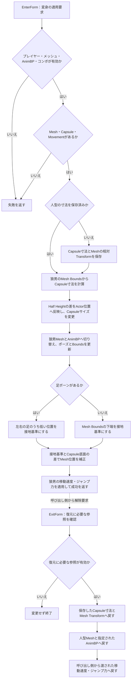
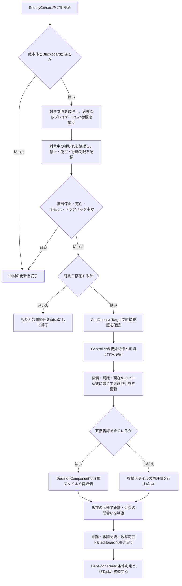
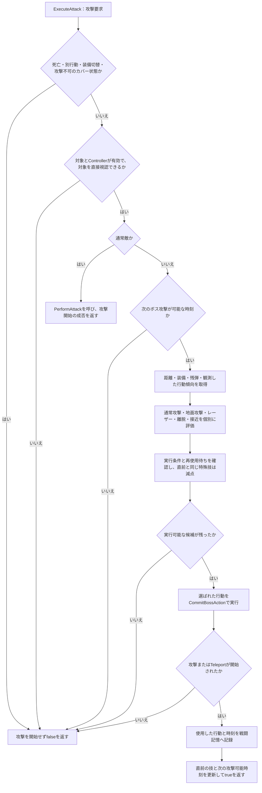

# 処理の流れ

[READMEへ戻る](../README.md)

掲載中のC++コードを読むためのフローチャートです。細かな補助処理は省略し、条件分岐と各部品の役割をまとめています。未掲載のBlueprintを含むゲーム全体の動作保証や、実機検証結果を表す図ではありません。

## 1. 人型と人狼の切り替え

体格を変えるだけでは足元の高さがずれるため、Capsuleの寸法変更とMeshの位置補正を分けて処理しています。

人型の寸法は最初の変身時だけ保存します。解除時に狼男の値を基準に逆算し続けず、保存した値へ戻すことで補正の累積を避けています。人型のMesh・AnimBP・移動性能は解除時の引数で受け取ります。変身の受付、残り時間、カメラ演出はこの部品の外側で管理されるため、図の対象外です。

参照：[WerewolfFormComponent.cpp](../Source/ProtectFromWolf/Private/Player/WerewolfFormComponent.cpp) の `EnterForm`・`ExitForm`。

## 2. 敵が判断に使う情報の更新

この図はBehavior Treeの配置図ではなく、Serviceが判断材料を更新する流れです。更新間隔は0.2秒です。

対象の参照を持つことと、直接視認できることは別です。また、現行のBlackboardの `CanSeeTarget` は名前に反して、直接視認だけでなくControllerの戦闘認識やカバー使用状態も含む値です。攻撃範囲の更新では直接視認も確認します。ここを分けて読むと、「相手を見失ったが警戒は続いている」状態を追いやすくなります。

遮蔽物行動は単純な移動先の設定だけではなく、カバーへの移動、待機、射撃位置への移動、射撃可能時間、リロードなどを別の部品で扱います。必ず遮蔽物を選ぶという意味ではありません。

参照：[BTService_EnemyContext.cpp](../Source/ProtectFromWolf/Private/AI/BehaviorTree/Services/BTService_EnemyContext.cpp)、[EnemyCoverComponent.cpp](../Source/ProtectFromWolf/Private/Enemy/Components/EnemyCoverComponent.cpp)、[EnemyBehaviorTasks.cpp](../Source/ProtectFromWolf/Private/AI/BehaviorTree/Tasks/EnemyBehaviorTasks.cpp)。

## 3. ボスが次の攻撃を選ぶ流れ

攻撃の「スタイル変更」と「具体的な技の選択」は別の処理です。以下は `ExecuteAttack` から技を選ぶ部分です。

例えば、通常攻撃は残弾や近接の間合いを確認し、レーザーは距離と静止傾向などから評価します。離脱・接近のTeleportはラストボス用の条件があります。候補が残らない場合や技が開始できなかった場合には、成功したことにせず戻ります。

`CommitBossAction` には跳躍と連続射撃の分岐もありますが、現在の `ExecuteAttack` の候補一覧には登録されていないため、この図には含めていません。行動傾向の記録を使う仕組みであり、機械学習で訓練したものではありません。

参照：[EnemyDecisionComponent.cpp](../Source/ProtectFromWolf/Private/Enemy/Components/EnemyDecisionComponent.cpp) の `ExecuteAttack`・`CommitBossAction`・`UpdateBossStyle`、[EnemyCombatMemoryComponent.cpp](../Source/ProtectFromWolf/Private/Enemy/Components/EnemyCombatMemoryComponent.cpp)。
